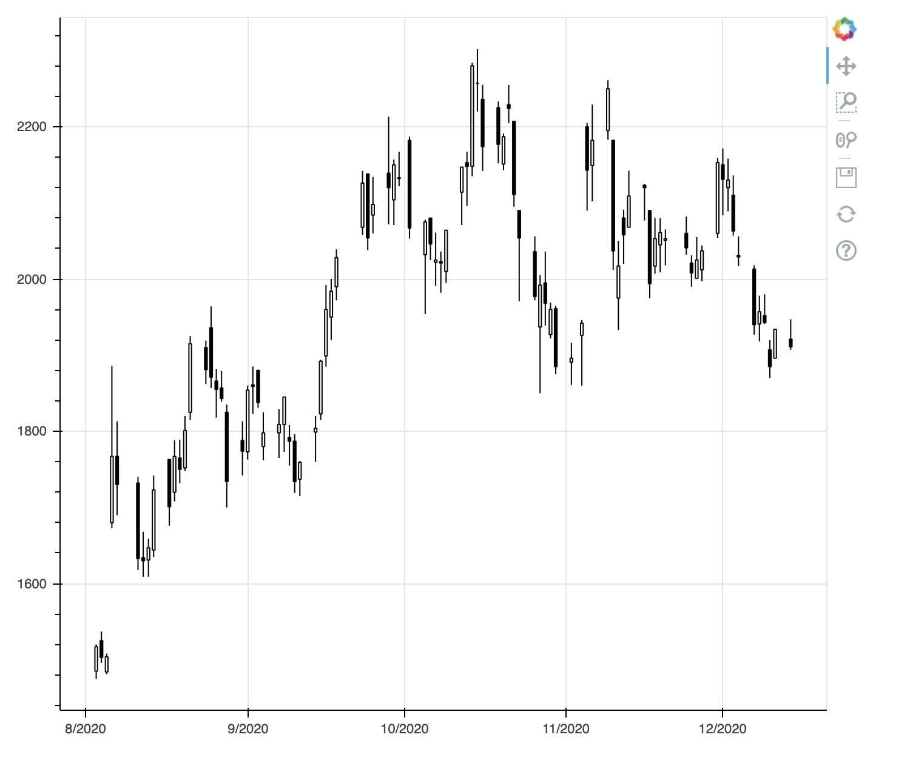
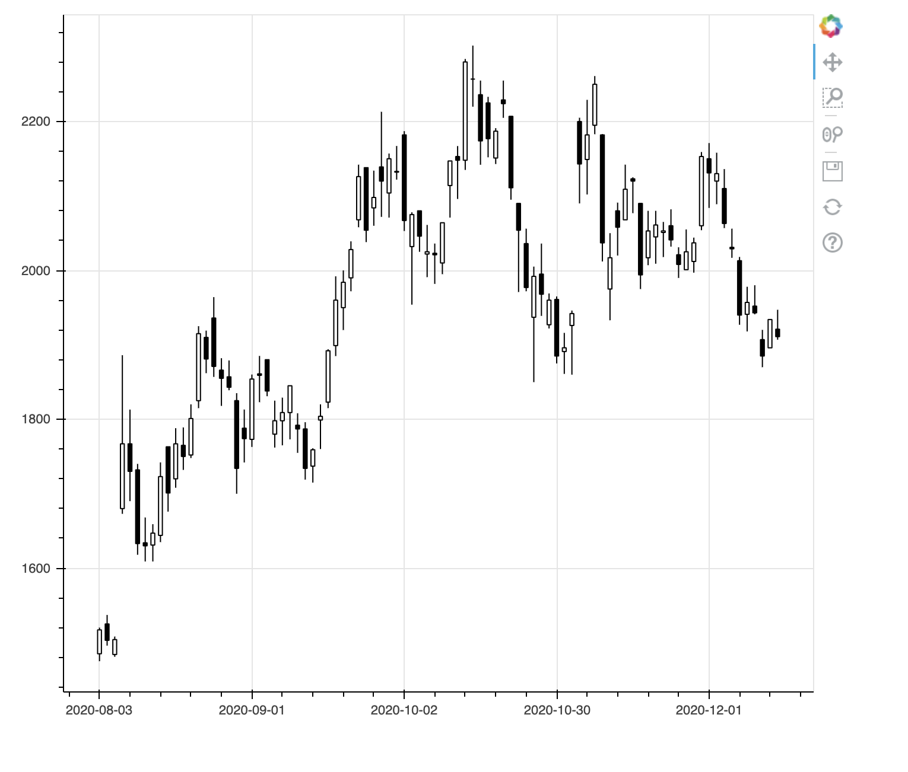
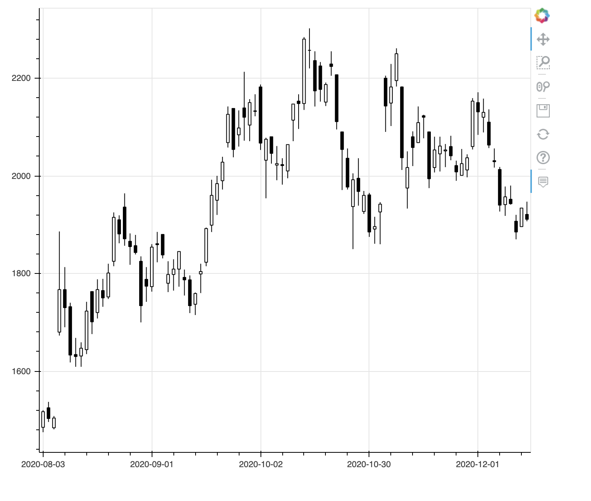
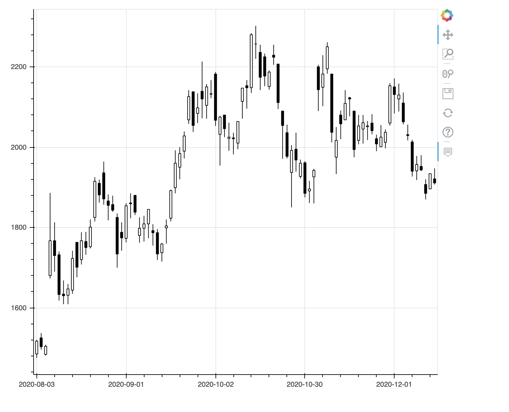
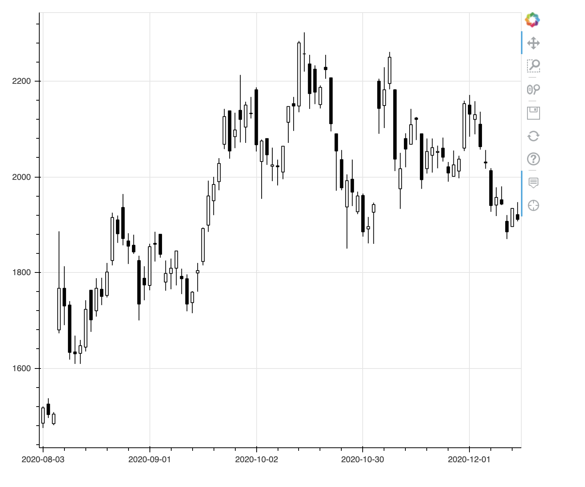
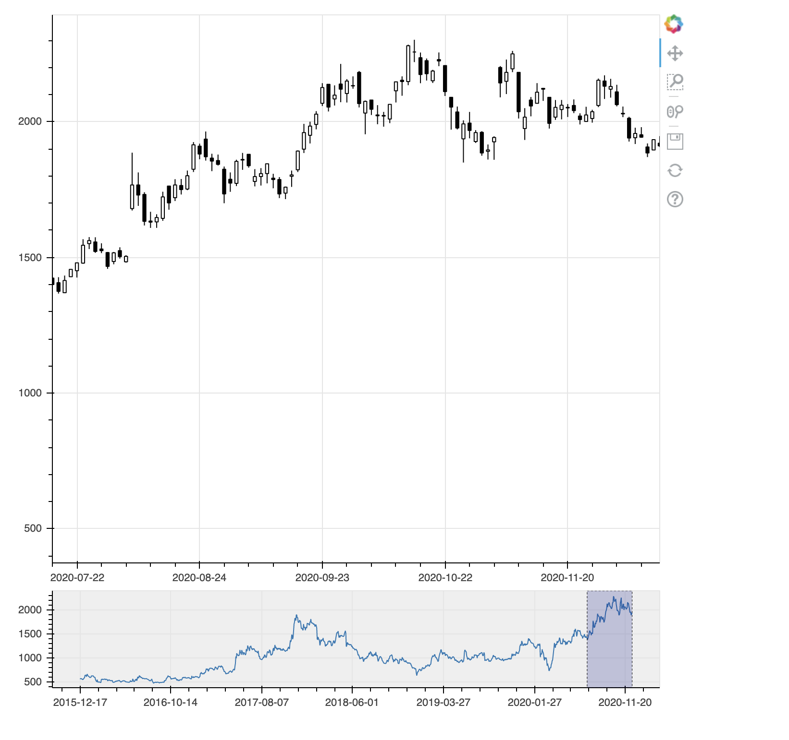
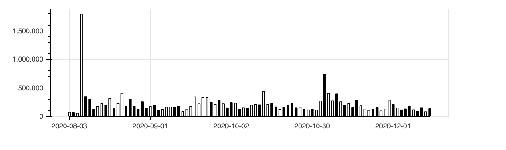
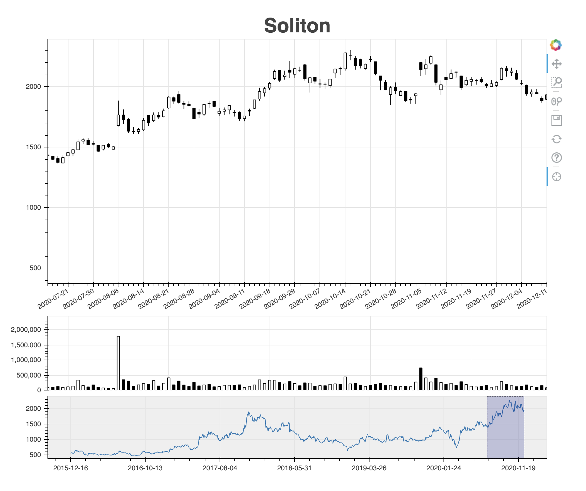
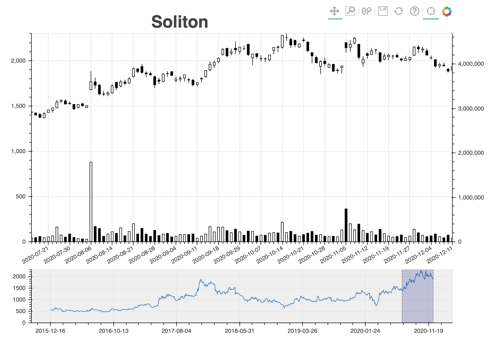

[](https://github.com/Soliton-Analytics-Team/Candlestick/raw/main/Candlestick.ipynb)

# Google Colabでグリグリ動くローソク足をBokehで生成してみた

Bokehは簡単にインタラクティブなグラフを生成できるpythonのライブラリです。ローソク足も[ここ](https://docs.bokeh.org/en/latest/docs/gallery/candlestick.html)にサンプルがあります。これを元に、さらに高機能化してみたいと思います。なお、データの取得以外は単独のセルで動作するように記述しています。

まず、弊社の株価を取得します。


```Python
import pandas_datareader.data as web
solitondata=web.DataReader("3040.JP", "stooq").dropna().sort_index()
solitondata
```

<table border="1" class="dataframe">
  <thead>
    <tr style="text-align: right;">
      <th></th>
      <th>Open</th>
      <th>High</th>
      <th>Low</th>
      <th>Close</th>
      <th>Volume</th>
    </tr>
    <tr>
      <th>Date</th>
      <th></th>
      <th></th>
      <th></th>
      <th></th>
      <th></th>
    </tr>
  </thead>
  <tbody>
    <tr>
      <th>2015-12-02</th>
      <td>559.19</td>
      <td>561.63</td>
      <td>555.77</td>
      <td>558.21</td>
      <td>13744</td>
    </tr>
    <tr>
      <th>2015-12-03</th>
      <td>558.21</td>
      <td>563.09</td>
      <td>541.15</td>
      <td>553.34</td>
      <td>19897</td>
    </tr>
    <tr>
      <th>2015-12-04</th>
      <td>532.37</td>
      <td>553.34</td>
      <td>532.37</td>
      <td>550.90</td>
      <td>12102</td>
    </tr>
    <tr>
      <th>2015-12-07</th>
      <td>553.34</td>
      <td>558.21</td>
      <td>544.07</td>
      <td>558.21</td>
      <td>9436</td>
    </tr>
    <tr>
      <th>2015-12-08</th>
      <td>569.91</td>
      <td>569.91</td>
      <td>553.34</td>
      <td>563.09</td>
      <td>41639</td>
    </tr>
    <tr>
      <th>...</th>
      <td>...</td>
      <td>...</td>
      <td>...</td>
      <td>...</td>
      <td>...</td>
    </tr>
    <tr>
      <th>2020-11-20</th>
      <td>2051.00</td>
      <td>2065.00</td>
      <td>2018.00</td>
      <td>2053.00</td>
      <td>106400</td>
    </tr>
    <tr>
      <th>2020-11-24</th>
      <td>2060.00</td>
      <td>2082.00</td>
      <td>2032.00</td>
      <td>2041.00</td>
      <td>121300</td>
    </tr>
    <tr>
      <th>2020-11-25</th>
      <td>2021.00</td>
      <td>2031.00</td>
      <td>1990.00</td>
      <td>2008.00</td>
      <td>154100</td>
    </tr>
    <tr>
      <th>2020-11-26</th>
      <td>2001.00</td>
      <td>2055.00</td>
      <td>2001.00</td>
      <td>2025.00</td>
      <td>96700</td>
    </tr>
    <tr>
      <th>2020-11-27</th>
      <td>2012.00</td>
      <td>2044.00</td>
      <td>1997.00</td>
      <td>2037.00</td>
      <td>130700</td>
    </tr>
  </tbody>
</table>
<p>1216 rows × 5 columns</p>


[公式サンプル](https://docs.bokeh.org/en/latest/docs/gallery/candlestick.html)を元にした最小構成のコードは以下になります。


```Python
from bokeh.plotting import figure, show, output_notebook

df = solitondata['2020-8-1':] # データの範囲を絞る
 
inc = df.Close >= df.Open   # 始値より終値が高いデータのブール値配列
dec = df.Open > df.Close    # 始値より終値が低いデータのブール値配列
w = (df.index[1] - df.index[0]) / 2  # X軸の1メモリの半分

fig = figure(x_axis_type="datetime", plot_width=1000) # X座標のデータ型と図の幅を指定
fig.segment(df.index, df.High, df.index, df.Low, color="black")  # 安値と高値の直線を描画
fig.vbar(df.index[inc], w, df.Open[inc], df.Close[inc], fill_color="white", line_color="black") # 上昇時の矩形を描画
fig.vbar(df.index[dec], w, df.Open[dec], df.Close[dec], fill_color="black", line_color="black") # 下降時の矩形を描画

output_notebook()  # 出力先をノートブックに設定
show(fig)  # 図を表示
```



土日など取引がない日付でローソク足に間が空いています。これはこれで良さそうですが、実はよろしくありません。なぜならば、大部分の人は間が空いていないローソク足を見ているからです。取引するのは人間（今はそうとも限りませんが）なので、その心理を左右する図を見る必要があります。

Bokehの図ではインデックスがX軸になります。そこでインデックスを日付からレコード順に変更します。さらにレコード順とX軸に表示する日付との対応を設定します。


```Python
from bokeh.plotting import figure, show, output_notebook
import pandas as pd

df = solitondata['2020-8-1':] # データの範囲を絞る
df = df.reset_index() # インデックスをレコード順に変更
 
inc = df.Close >= df.Open  # 始値より終値が高いデータのブール値配列
dec = df.Open > df.Close  # 始値より終値が低いデータのブール値配列
w = (df.index[1] - df.index[0]) / 2  # X軸の1メモリの半分

fig = figure(plot_width=1000)  # 図の幅を指定
fig.segment(df.index, df.High, df.index, df.Low, color="black")  # 安値と高値の直線を描画
fig.vbar(df.index[inc], w, df.Open[inc], df.Close[inc], fill_color="white", line_color="black")  # 上昇時の矩形を描画
fig.vbar(df.index[dec], w, df.Open[dec], df.Close[dec], fill_color="black", line_color="black") # 下降時の矩形を描画
fig.xaxis.major_label_overrides = {  # X軸の表示の対応を指定
    i: pd.to_datetime(date).strftime('%Y-%m-%d') for i, date in enumerate(df['Date'])
}

output_notebook()  # 出力先をノートブックに設定
show(fig)  # 図を表示
```



うまく土日などの取引のない日を詰めて表示できました。ただ、右下に80と表示されていて不格好です。元々の範囲を超えた部分は表記が置き換えられないようです。これを回避するにはxaxis.boundsで明示的に範囲を指定します。ここでは、左右に隙間が開くのが格好悪いので、(0, df.index[-1])ではなく(-1, df.index[-1]+1)にしてみました。


```Python
from bokeh.plotting import figure, show, output_notebook
import pandas as pd

df = solitondata['2020-8-1':] # データの範囲を絞る
df = df.reset_index() # インデックスをレコード順に変更
 
inc = df.Close >= df.Open  # 始値より終値が高いデータのブール値配列
dec = df.Open > df.Close  # 始値より終値が低いデータのブール値配列
w = (df.index[1] - df.index[0]) / 2  # X軸の1メモリの半分

fig = figure(plot_width=1000)  # 図の幅を指定
fig.segment(df.index, df.High, df.index, df.Low, color="black")  # 安値と高値の直線を描画
fig.vbar(df.index[inc], w, df.Open[inc], df.Close[inc], fill_color="white", line_color="black")  # 上昇時の矩形を描画
fig.vbar(df.index[dec], w, df.Open[dec], df.Close[dec], fill_color="black", line_color="black") # 下降時の矩形を描画
fig.xaxis.major_label_overrides = {  # X軸の表示の対応を指定
    i: pd.to_datetime(date).strftime('%Y-%m-%d') for i, date in enumerate(df['Date'])
}
fig.xaxis.bounds = (-1, df.index[-1] + 1) # X軸の範囲を明示的に指定
fig.x_range.range_padding = 0.01  # X軸の表記の頻度を調整

output_notebook()  # 出力先をノートブックに設定
show(fig)  # 図を表示
```


次に吹き出しで値を表示するようにしてみます。そのために元データをColumnDataSourceに変換する必要があります。その上で、figure()のtooltips引数に表示する属性を指定します。


```Python
from bokeh.plotting import figure, show, output_notebook
from bokeh.models import ColumnDataSource
import pandas as pd

df = solitondata['2020-8-1':].reset_index()
source = ColumnDataSource(df)
inc = ColumnDataSource(df[df.Close >= df.Open])
dec = ColumnDataSource(df[df.Open > df.Close])
w = (df.index[1] - df.index[0]) / 2  # X軸の1メモリの半分

fig = figure(plot_width=1000,
            tooltips=[("Date", "@Date"),
                      ("Open", "@Open"),
                      ("High", "@High"),
                      ("Low", "@Low"),
                      ("Close", "@Close"),
                      ("Volume", "@Volume{,}")])
fig.segment('index', 'High', 'index', 'Low', source=source, color="black")
fig.vbar('index', w, 'Open', 'Close', source=inc, line_color="black", fill_color="white")
fig.vbar('index', w, 'Open', 'Close', source=dec, line_color="black", fill_color="black")
fig.xaxis.major_label_overrides = {
    i: pd.to_datetime(date).strftime('%Y-%m-%d') for i, date in enumerate(source.data['Date'])
}
fig.xaxis.bounds = (-1, df.index[-1] + 1)
fig.x_range.range_padding = 0.01

output_notebook()  # 出力先をノートブックに設定
show(fig)
```



吹き出し表示は日付以外はうまくできています。いろいろ試しましたが、figure()のtooltipsの指定では日付のフォーマットを指定できないようです。仕方ないので、DateStrというカラムを増設して日付の文字表記を格納します。


```Python
from bokeh.plotting import figure, show, output_notebook
from bokeh.models import ColumnDataSource
import pandas as pd
import numpy as np

df = solitondata['2020-8-1':].reset_index()
df['DateStr'] = [pd.to_datetime(date).strftime('%Y-%m-%d') for date in source.data['Date']] # 日付の文字表記を格納
source = ColumnDataSource(df)
inc = ColumnDataSource(df[df.Close >= df.Open])
dec = ColumnDataSource(df[df.Open > df.Close])
w = (df.index[1] - df.index[0]) / 2  # X軸の1メモリの半分

fig = figure(plot_width=1000,
            tooltips=[("Date", "@DateStr"), # 日付の文字表記を指定
                      ("Open", "@Open"),
                      ("High", "@High"),
                      ("Low", "@Low"),
                      ("Close", "@Close"),
                      ("Volume", "@Volume{,}")])
fig.segment('index', 'High', 'index', 'Low', source=source, color="black")
fig.vbar('index', w, 'Open', 'Close', source=inc, line_color="black", fill_color="white")
fig.vbar('index', w, 'Open', 'Close', source=dec, line_color="black", fill_color="black")
fig.xaxis.major_label_overrides = {
    i: pd.to_datetime(date).strftime('%Y-%m-%d') for i, date in enumerate(source.data['Date'])
}
fig.xaxis.bounds = (-1, df.index[-1] + 1)
fig.x_range.range_padding = 0.01

output_notebook()  # 出力先をノートブックに設定
show(fig)
```



吹き出しの日付表示もうまくいきました。

別の方法としてHoverToolを追加してフォーマットを指定する方法もあります。ついでにCrosshairToolも追加してみましょう。


```Python
from bokeh.plotting import figure, show, output_notebook
from bokeh.models import HoverTool, CrosshairTool, ColumnDataSource
import pandas as pd

df = solitondata['2020-8-1':].reset_index()
source = ColumnDataSource(df)
inc = ColumnDataSource(df[df.Close >= df.Open])
dec = ColumnDataSource(df[df.Open > df.Close])
w = (df.index[1] - df.index[0]) / 2  # X軸の1メモリの半分

fig = figure(plot_width=1000)
fig.segment('index', 'High', 'index', 'Low', source=source, color="black")
fig.vbar('index', w, 'Open', 'Close', source=inc, line_color="black", fill_color="white")
fig.vbar('index', w, 'Open', 'Close', source=dec, line_color="black", fill_color="black")
fig.xaxis.major_label_overrides = {
    i: pd.to_datetime(date).strftime('%Y-%m-%d') for i, date in enumerate(source.data['Date'])
}
fig.xaxis.bounds = (-1, df.index[-1] + 1)
fig.x_range.range_padding = 0.01

hoverTool = HoverTool(
    tooltips=[('Date', '@Date{ %F}'), # フォーマッターを指定する書き方
              ('Open', '@Open'),
              ('High', '@High'),
              ('Low', '@Low'),
              ('Close', '@Close'),
              ('Volume',  '@Volume\\{,\\}')],

    formatters={
        '@Date' : 'datetime', # 日付のフォーマットに　datetime　を使用
    },

    mode='vline',  # 縦方向にマッチする値を表示
    # mode='mouse',  # マウスポインタにマッチする値を表示
)

fig.add_tools(hoverTool)
fig.add_tools(CrosshairTool())

output_notebook()  # 出力先をノートブックに設定
show(fig)
```



吹き出しの日付表示もうまくいきました。ただ、意外と吹き出し表示は邪魔ですね。以下のコードでは外します。

RangeToolを使うと、データの表示範囲を全体を俯瞰しつつインタラクティブに変更できます。この時、figure()でx_rangeを指定しないとうまく表示されませんので注意してください。


```Python
from bokeh.plotting import figure, show, output_notebook, output_file
from bokeh.layouts import column
from bokeh.models import RangeTool, ColumnDataSource
import pandas as pd

df = solitondata.reset_index() # インデックスをレコード順に変更
source = ColumnDataSource(df)
inc = ColumnDataSource(df[df.Close >= df.Open])
dec = ColumnDataSource(df[df.Open > df.Close])
w = (df.index[1] - df.index[0]) / 2  # X軸の1メモリの半分

fig = figure(plot_width=1000, x_range=(df.index[-100], df.index[-1]))  # 図の幅と初期の表示範囲を指定
fig.segment('index', 'High', 'index', 'Low', source=source, color="black")
fig.vbar('index', w, 'Open', 'Close', source=inc, line_color="black", fill_color="white")
fig.vbar('index', w, 'Open', 'Close', source=dec, line_color="black", fill_color="black")
fig.xaxis.major_label_overrides = {  # X軸の表示の対応を指定
    i: pd.to_datetime(date).strftime('%Y-%m-%d') for i, date in enumerate(df['Date'])
}
fig.xaxis.bounds = (0, df.index[-1])

range_tool = RangeTool(x_range=fig.x_range)
range_tool.overlay.fill_color = "navy"
range_tool.overlay.fill_alpha = 0.2

select = figure(plot_width=1000, plot_height=130, y_range=fig.y_range,
                tools="", toolbar_location=None, background_fill_color="#efefef")
select.line('index', 'Close', source=source)
select.xaxis.major_label_overrides = {  # X軸の表示の対応を指定
    i: pd.to_datetime(date).strftime('%Y-%m-%d') for i, date in enumerate(df['Date'])
}
select.add_tools(range_tool)

output_notebook()  # 出力先をノートブックに設定
show(column(fig, select))  # 図を表示
```



下段の範囲指定をドラッグすると上段のローソク足の表示範囲が同期します。範囲の左右の境界線をドラッグすると表示範囲の幅が変わります。

出来高のグラフも追加しましょう。まずは、出来高単独のグラフです。価格が上がったときの出来高を白抜き、下がった時を黒塗りで表示します。


```Python
from bokeh.plotting import figure, show, output_notebook
from bokeh.models import ColumnDataSource, NumeralTickFormatter
import pandas as pd

df = solitondata['2020-8-1':].reset_index()
source = ColumnDataSource(df)
inc = ColumnDataSource(df[df.Close >= df.Open])
dec = ColumnDataSource(df[df.Open > df.Close])
w = (df.index[1] - df.index[0]) / 2  # X軸の1メモリの半分

volume = figure(plot_width=1000, plot_height=200, tools="", toolbar_location=None, tooltips=[("Volume", "@Volume{0,0}")])
volume.vbar('index', w, 'Volume', source=inc, line_color="black", fill_color="white")
volume.vbar('index', w, 'Volume', source=dec, line_color="black", fill_color="black")
volume.xaxis.major_label_overrides = {
    i: pd.to_datetime(date).strftime('%Y-%m-%d') for i, date in enumerate(source.data['Date'])
}
volume.xaxis.bounds = (0, df.index[-1])
volume.yaxis.formatter = NumeralTickFormatter(format="0,0")  # Y軸の表示形式を指定
volume.y_range.start = 0
volume.xaxis.major_tick_in = 0
volume.xaxis.minor_tick_out = 0

output_notebook()  # 出力先をノートブックに設定
show(volume)
```



次に、ローソク足の下に出来高のグラフを表示させます。ここでは、図のタイトルを設定しました。また、図の横幅をページの幅に応じて伸縮するようにしています。


```Python
from bokeh.plotting import figure, show, output_notebook, output_file
from bokeh.layouts import column
from bokeh.models import RangeTool, ColumnDataSource, CrosshairTool, NumeralTickFormatter
import pandas as pd
import math

df = solitondata.reset_index() # インデックスをレコード順に変更
source = ColumnDataSource(df)
inc = ColumnDataSource(df[df.Close >= df.Open])
dec = ColumnDataSource(df[df.Open > df.Close])
w = (df.index[1] - df.index[0]) / 2  # X軸の1メモリの半分

# ローソク足を作成
fig = figure(x_range=(df.index[-100], df.index[-1]))  # 図の表示範囲を指定
fig.segment('index', 'High', 'index', 'Low', source=source, color="black")
fig.vbar('index', w, 'Open', 'Close', source=inc, line_color="black", fill_color="white")
fig.vbar('index', w, 'Open', 'Close', source=dec, line_color="black", fill_color="black")
fig.xaxis.major_label_overrides = {  # X軸の表示の対応を指定
    i: pd.to_datetime(date).strftime('%Y-%m-%d') for i, date in enumerate(df['Date'])
}
fig.xaxis.bounds = (0, df.index[-1])
fig.xaxis.major_label_orientation = math.radians(30) # X軸の表示角度
fig.xaxis.ticker.desired_num_ticks = 20  # X軸の表示間隔調整

# 図のタイトルを設定
fig.title.text = 'Soliton'
fig.title.align = 'center'
fig.title.text_font_size = '24pt'

# 出来高の棒グラフを作成
volume = figure(plot_height=130, x_range=fig.x_range, tools="", toolbar_location=None, tooltips=[("Volume", "@Volume{0,0}")])
volume.vbar('index', w, 'Volume', source=inc, line_color="black", fill_color="white")
volume.vbar('index', w, 'Volume', source=dec, line_color="black", fill_color="black")
volume.yaxis.formatter = NumeralTickFormatter(format="0,0")  # Y軸の表示形式を指定
volume.y_range.start = 0  # Y軸の原点を0にする
volume.xaxis.visible = False  # X軸のメモリを非表示にする

# 十字表示を設定
crosshair = CrosshairTool()
fig.add_tools(crosshair)
volume.add_tools(crosshair)

# 範囲ツールを設定
range_tool = RangeTool(x_range=fig.x_range)
range_tool.overlay.fill_color = "navy"
range_tool.overlay.fill_alpha = 0.2

# 範囲選択用の図を作成
select = figure(plot_height=130, y_range=fig.y_range,
                tools="", toolbar_location=None, background_fill_color="#efefef")
select.line('index', 'Close', source=source)  # 範囲選択用の図には終値を表示
select.xaxis.major_label_overrides = {  # X軸の表示の対応を指定
    i: pd.to_datetime(date).strftime('%Y-%m-%d') for i, date in enumerate(df['Date'])
}
select.add_tools(range_tool)

output_notebook()  # 出力先をノートブックに設定
output_file('soliton.html') # ファイルにも出力
show(column(fig, volume, select, sizing_mode='stretch_width'))  # 図を表示
```



最後に、少し複雑になりますが、出来高をローソク足と同じグラフに表示するようにしてみます。縦軸を2軸にして、右側を出来高にします。縦軸の範囲が二種類になるので、それぞれ明示的に範囲を指定しないと表示がうまくいきませんのでご注意ください。


```Python
from bokeh.plotting import figure, show, output_notebook, output_file
from bokeh.layouts import column
from bokeh.models import RangeTool, ColumnDataSource, CrosshairTool, NumeralTickFormatter, Range1d, LinearAxis
import pandas as pd
import math

df = solitondata.reset_index() # インデックスをレコード順に変更
source = ColumnDataSource(df)
inc = ColumnDataSource(df[df.Close >= df.Open])
dec = ColumnDataSource(df[df.Open > df.Close])
w = (df.index[1] - df.index[0]) / 2  # X軸の1メモリの半分

# ローソク足を作成
fig = figure(x_range=(df.index[-100], df.index[-1]), y_range=(0, max(df.High)), toolbar_location="above")  # 図の表示範囲を指定
fig.segment('index', 'High', 'index', 'Low', source=source, color="black")
fig.vbar('index', w, 'Open', 'Close', source=inc, line_color="black", fill_color="white")
fig.vbar('index', w, 'Open', 'Close', source=dec, line_color="black", fill_color="black")
fig.xaxis.major_label_overrides = {  # X軸の表示の対応を指定
    i: pd.to_datetime(date).strftime('%Y-%m-%d') for i, date in enumerate(df['Date'])
}
fig.xaxis.bounds = (0, df.index[-1])
fig.xaxis.major_label_orientation = math.radians(30) # X軸の表示角度
fig.xaxis.ticker.desired_num_ticks = 20  # X軸の表示間隔調整

# 出来高をローソク足と同じグラフに表示
fig.extra_y_ranges = {"volume": Range1d(start=0, end=max(df.Volume) * 2)}
fig.add_layout(LinearAxis(y_range_name="volume"), 'right')
fig.vbar('index', w, 'Volume', source=inc, line_color="black", fill_color="white", y_range_name="volume")
fig.vbar('index', w, 'Volume', source=dec, line_color="black", fill_color="black", y_range_name="volume")
fig.yaxis.formatter = NumeralTickFormatter(format="0,0")

# 図のタイトルを設定
fig.title.text = 'Soliton'
fig.title.align = 'center'
fig.title.text_font_size = '24pt'

# 十字表示を設定
fig.add_tools(CrosshairTool())

# 範囲ツールを設定
range_tool = RangeTool(x_range=fig.x_range)
range_tool.overlay.fill_color = "navy"
range_tool.overlay.fill_alpha = 0.2

# 範囲選択用の図を作成
select = figure(plot_height=130, y_range=fig.y_range,
                tools="", toolbar_location=None, background_fill_color="#efefef")
select.line('index', 'Close', source=source)  # 範囲選択用の図には終値を表示
select.xaxis.major_label_overrides = {  # X軸の表示の対応を指定
    i: pd.to_datetime(date).strftime('%Y-%m-%d') for i, date in enumerate(df['Date'])
}
select.add_tools(range_tool)

output_notebook()  # 出力先をノートブックに設定
output_file('soliton.html') # ファイルにも出力
show(column(fig, select, sizing_mode='stretch_width'))  # 図を表示
```



以上です
